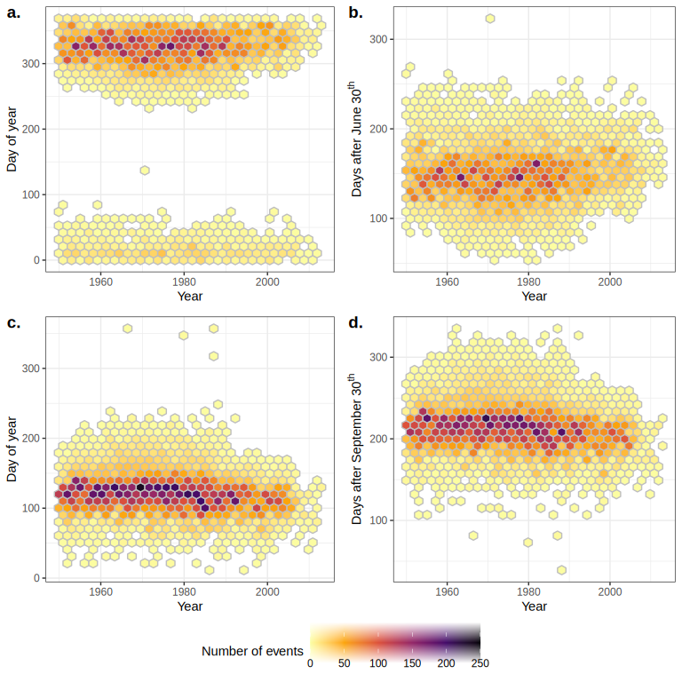
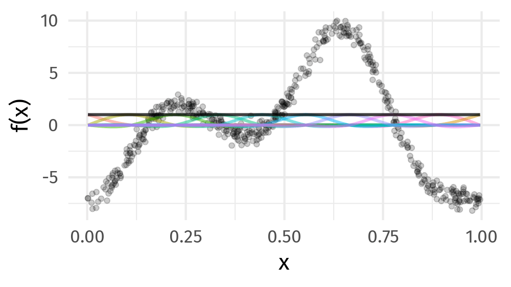

### Land acknowledgment

* This work was done at URegina on Treaty 4 lands

### Funding

.row[

.col-6[
.center[]
]

.col-6[
.center[]
]

]

### Data

* Lake ice data from [Global Lake and River Ice Phenology Database](http://nsidc.org/data/G01377.html)
* Lake ice study joint work with Stefano Mezzini

* <bit.ly/circle-u-2023>

<!-- ### Slides

* HTML Slide deck [bit.ly/circle-u-2023](http://bit.ly/circle-u-2023) &copy; Simpson & Mezzini (2023) [](http://creativecommons.org/licenses/by/4.0/) -->

???

This research was conducted while we were at the University of Regina, which is situated on the territories of the nay-hi-yuh-wuk (Cree; nêhiyawak), uh-nish-i-naa-payk (Salteaux; Anihšināpēk), Dakota, Lakota, and Nakoda, and the homeland of the Métis/Michif Nation.

```{r setup, include=FALSE, cache=FALSE}
options(htmltools.dir.version = FALSE)
knitr::opts_chunk$set(cache = TRUE, dev = 'svg', echo = FALSE, message = FALSE, warning = FALSE,
                      fig.height=6, fig.width = 1.777777*6)

library("curl")
library("ggplot2")
library("dplyr")
library("tibble")
library('tidyr')
library('mgcv')
library('forcats')
library('mvnfast')
library('purrr')
library('gganimate')
library('gratia')
library('readr')
library("patchwork")
theme_set(theme_minimal(base_size = 14, base_family = 'Fira Sans'))
library('readxl')
library('here')

## constats
anim_width <- 1000
anim_height <- anim_width / 1.77777777
anim_dev <- 'png'
anim_res <- 200
```

---

# Lake Suwa ice record

<br />

.row[

.col-8[

```{r}

```


]

.col-4[

```{r}
knitr::include_graphics("resources/建御名方神_-_Takeminakata.jpg")
```

]

]

???

The ice record at Lake Suwa, Nagano Prefecture, Japan, is the oldest known human-observed climate record in the world, ice formation dates from 1443

Omiwatari or ice ridges form on the lake as pressure ridges that arise due to vertical thermal temperature gradients in the lake

Local Shinto tradition holds that these Omiwatari &mdash; or God's Crossing &mdash; are formed by God's crossing Lake Suwa to move between the buildings of the Suwa Grand Shrine

Folklore has it that the Omiwatari are formed when the Guardian God of Suwa, Takeminakata-no-kami, leaves his sanctuary to visit his wife the goddess Yasakotame

---

# Lake ice records

.row[

.col-7[

* Collected for *economical*, *recreational*, & *religious* purposes
* Support a range of activities
    * Winter transportation
    * Fishing
    * Social activities
    * Spiritual ceremonies
* Excellent indicators of climate change
* Lake ice phenology sensitive to changes in climate 

]

.col-5[

```{r}

```

]

]

---

# Trends in lake ice phenology

Magnuson *et al* (2000) &mdash, seminal study of trends in lake ice phenology

Confirmed by multiple follow-up studies

Long-term records of lake ice phenology demonstrated that many Northern Hemisphere lakes experienced earlier ice breakup, later ice freeze-up, and shorter ice duration within a warming world

<br />

[Magnuson *et al* (2000) Science 289, 1743–1746](https://doi.org/10.1126/science.289.5485.1743)

???

Magnuson et al. (2000) observed long-term changes in lake ice cover in 20 spatially and morphologically heterogeneous lakes from 1855 to 1995. These long-term records of lake ice phenology demonstrated that many Northern Hemisphere lakes experienced earlier ice breakup, later ice freeze-up, and shorter ice duration within a warming world

---

# Global Lake and River Ice Phenology DB

.center[
```{r include-map-figure, out.width = 550, out.height = 550}
knitr::include_graphics("resources/animated-map.gif")
```
]

---

# Problems

.row[

.col-6[

* time to ice-on or ice-off positive & continuous

* linear trends to estimate shifts in phenology
]

.col-6[
.center[
```{r include-dates-figure, out.width = 550, out.height = 550}

```
]
]
]

---

# Time-to-event &mdash; Event history models

Follow-up times `->` Survival analysis model

Piece-wise exponential model is essentially a Poisson GLM on transformed data &mdash; hazard rate is piece-wise constant within time intervals

--

Piece-wise exponential additive mixed model &mdash; PAMM

Estimate hazard rate as a smooth function rather than a step function

Can include all of *mgcv* 📦 tools for GAMs

*pammtools* 📦 (Bender, Groll, Scheipl, 2018 *Statistical Modelling*)


???

hazard rate is piece-wise constant within time intervals but we estimate it semi-parametrically

---

# PAMMs

.center[
```{r include-mendota-figure}
knitr::include_graphics("resources/mendota-freeze-viz.svg")
```
]


```{r smooth-fun-animation, results = FALSE}
f <- function(x) {
    x^11 * (10 * (1 - x))^6 + ((10 * (10 * x)^3) * (1 - x)^10)
}

draw_beta <- function(n, k, mu = 1, sigma = 1) {
    rmvn(n = n, mu = rep(mu, k), sigma = diag(rep(sigma, k)))
}

weight_basis <- function(bf, x, n = 1, k, ...) {
    beta <- draw_beta(n = n, k = k, ...)
    out <- sweep(bf, 2L, beta, '*')
    colnames(out) <- paste0('f', seq_along(beta))
    out <- as_tibble(out)
    out <- add_column(out, x = x)
    out <- pivot_longer(out, -x, names_to = 'bf', values_to = 'y')
    out
}

random_bases <- function(bf, x, draws = 10, k, ...) {
    out <- rerun(draws, weight_basis(bf, x = x, k = k, ...))
    out <- bind_rows(out)
    out <- add_column(out, draw = rep(seq_len(draws), each = length(x) * k),
                      .before = 1L)
    class(out) <- c("random_bases", class(out))
    out
}

plot.random_bases <- function(x, facet = FALSE) {
    plt <- ggplot(x, aes(x = x, y = y, colour = bf)) +
        geom_line(lwd = 1, alpha = 0.75) +
        guides(colour = FALSE)
    if (facet) {
        plt + facet_wrap(~ draw)
    }
    plt
}

normalize <- function(x) {
    rx <- range(x)
    z <- (x - rx[1]) / (rx[2] - rx[1])
    z
}

set.seed(1)
N <- 500
data <- tibble(x     = runif(N),
               ytrue = f(x),
               ycent = ytrue - mean(ytrue),
               yobs  = ycent + rnorm(N, sd = 0.5))

k <- 10
knots <- with(data, list(x = seq(min(x), max(x), length = k)))
sm <- smoothCon(s(x, k = k, bs = "cr"), data = data, knots = knots)[[1]]$X
colnames(sm) <- levs <- paste0("f", seq_len(k))
basis <- pivot_longer(cbind(sm, data), -(x:yobs), names_to = 'bf')
basis

set.seed(2)
bfuns <- random_bases(sm, data$x, draws = 20, k = k)

smooth <- bfuns %>%
    group_by(draw, x) %>%
    summarise(spline = sum(y)) %>%
    ungroup()

p1 <- ggplot(smooth) +
    geom_line(data = smooth, aes(x = x, y = spline), lwd = 1.5) +
    labs(y = 'f(x)', x = 'x') +
    theme_minimal(base_size = 16, base_family = 'Fira Sans')

smooth_funs <- animate(
    p1 + transition_states(draw, transition_length = 4, state_length = 2) + 
    ease_aes('cubic-in-out'),
    nframes = 200, height = anim_height, width = anim_width, res = anim_res, dev = anim_dev)

anim_save('resources/spline-anim.gif', smooth_funs)
```

---
class: inverse middle center subsection

# GAMs use splines

---

# Splines formed from basis functions

```{r basis-functions, fig.height=6, fig.width = 1.777777*6}
ggplot(basis,
       aes(x = x, y = value, colour = bf)) +
    geom_line(lwd = 2, alpha = 0.5) +
    guides(colour = FALSE) +
    labs(x = 'x', y = 'b(x)') +
    theme_minimal(base_size = 20, base_family = 'Fira Sans')
```

???

Splines are built up from basis functions

Here I'm showing a cubic regression spline basis with 10 knots/functions

We weight each basis function to get a spline. Here all the basis functions have the same weight so they would fit a horizontal line

---

# Weight basis functions &#8680; spline

```{r basis-function-animation, results = 'hide'}
bfun_plt <- plot(bfuns) +
    geom_line(data = smooth, aes(x = x, y = spline),
              inherit.aes = FALSE, lwd = 1.5) +
    labs(x = 'x', y = 'f(x)') +
    theme_minimal(base_size = 14, base_family = 'Fira Sans')

bfun_anim <- animate(
    bfun_plt + transition_states(draw, transition_length = 4, state_length = 2) + 
    ease_aes('cubic-in-out'),
    nframes = 200, height = anim_height, width = anim_width, res = anim_res, dev = anim_dev)

anim_save('resources/basis-fun-anim.gif', bfun_anim)
```

.center[]

???

But if we choose different weights we get more wiggly spline

Each of the splines I showed you earlier are all generated from the same basis functions but using different weights

---

# Maximise penalised log-likelihood &#8680; &beta;

```{r basis-functions-anim, results = "hide"}
sm2 <- smoothCon(s(x, k = k, bs = "cr"), data = data, knots = knots)[[1]]$X
beta <- coef(lm(ycent ~ sm2 - 1, data = data))
wtbasis <- sweep(sm2, 2L, beta, FUN = "*")
colnames(wtbasis) <- colnames(sm2) <- paste0("F", seq_len(k))
## create stacked unweighted and weighted basis
basis <- as_tibble(rbind(sm2, wtbasis)) %>%
    add_column(x = rep(data$x, times = 2),
               type = rep(c('unweighted', 'weighted'), each = nrow(sm2)),
               .before = 1L)
##data <- cbind(data, fitted = rowSums(scbasis))
wtbasis <- as_tibble(rbind(sm2, wtbasis)) %>%
    add_column(x      = rep(data$x, times = 2),
               fitted = rowSums(.),
               type   = rep(c('unweighted', 'weighted'), each = nrow(sm2))) %>%
    pivot_longer(-(x:type), names_to = 'bf')
basis <- pivot_longer(basis, -(x:type), names_to = 'bf')

p3 <- ggplot(data, aes(x = x, y = ycent)) +
    geom_point(aes(y = yobs), alpha = 0.2) +
    geom_line(data = basis,
              mapping = aes(x = x, y = value, colour = bf),
              lwd = 1, alpha = 0.5) +
    geom_line(data = wtbasis,
              mapping = aes(x = x, y = fitted), lwd = 1, colour = 'black', alpha = 0.75) +
    guides(colour = FALSE) +
    labs(y = 'f(x)', x = 'x') +
    theme_minimal(base_size = 16, base_family = 'Fira Sans')

crs_fit <- animate(p3 + transition_states(type, transition_length = 4, state_length = 2) + 
                   ease_aes('cubic-in-out'),
                   nframes = 100, height = anim_height, width = anim_width, res = anim_res,
                   dev = anim_dev)

anim_save('./resources/gam-crs-animation.gif', crs_fit)
```

.center[]

???

Fitting a GAM involves finding the weights for the basis functions that produce a spline that fits the data best, subject to some constraints

---

.center[
```{r include-spatial-dates-figure, out.width = "80%"}
knitr::include_graphics("resources/p-freeze-thaw.svg")
```
]

---

# Results

.center[
```{r include-spatial-freeze-figure, out.width = 550, out.height = 550}
knitr::include_graphics("resources/hpam-spatial-freeze.svg")
```
]

---

# Change in freeze dates

.row[

.col-12[
```{r include-freeze-figure, out.width = "90%", fig.align = "center"}

```

]

]

---

# Change in thaw dates

.row[

.col-12[
```{r include-thaw-figure, out.width = "90%", fig.align = "center"}

```

]

]

---

# Summary


